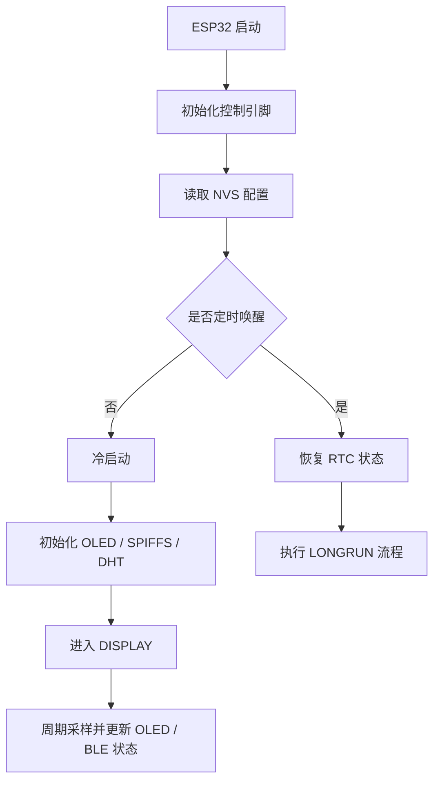
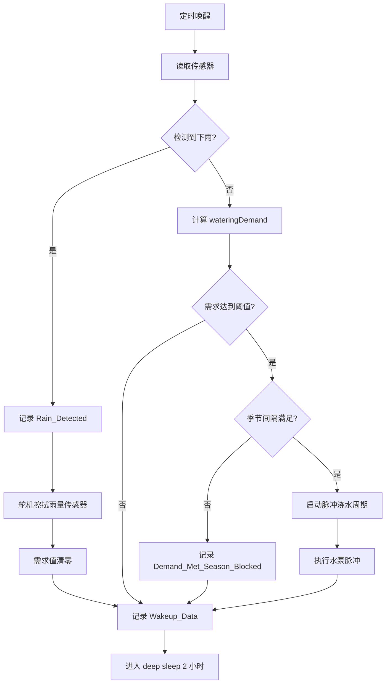
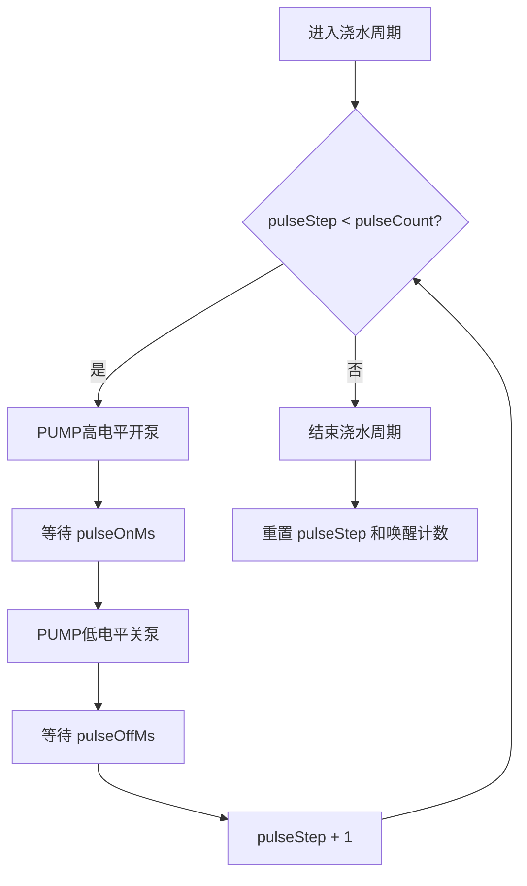
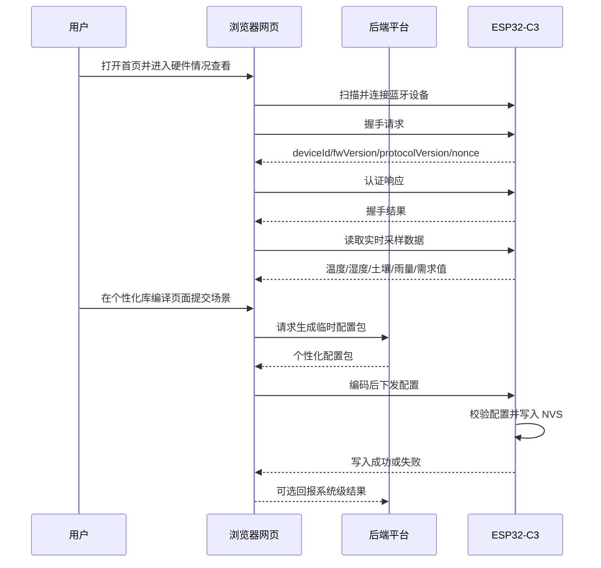
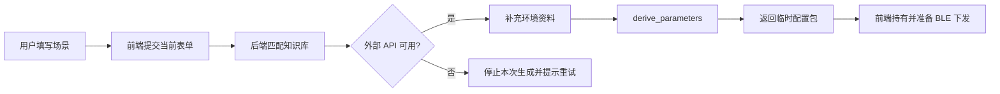
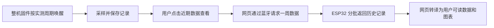

# 流程图

## 启动与模式流程

```mermaid
flowchart TD
    A["ESP32 启动"] --> B["初始化控制引脚"]
    B --> C["读取 NVS 配置"]
    C --> D{"是否定时唤醒"}
    D -->|否| E["冷启动"]
    E --> F["初始化 OLED / SPIFFS / DHT"]
    F --> G["进入 DISPLAY"]
    G --> H["周期采样并更新 OLED / BLE 状态"]
    D -->|是| J["恢复 RTC 状态"]
    J --> K["执行 LONGRUN 流程"]
```

## LONGRUN 唤醒决策

```mermaid
flowchart TD
    A["定时唤醒"] --> B["读取传感器"]
    B --> C{"检测到下雨?"}
    C -->|是| D["记录 Rain_Detected"]
    D --> E["舵机擦拭雨量传感器"]
    E --> F["需求值清零"]
    C -->|否| G["计算 wateringDemand"]
    G --> H{"需求达到阈值?"}
    H -->|否| I["记录 Wakeup_Data"]
    H -->|是| J{"季节间隔满足?"}
    J -->|否| K["记录 Demand_Met_Season_Blocked"]
    J -->|是| L["启动脉冲浇水周期"]
    F --> I
    K --> I
    L --> M["执行水泵脉冲"]
    M --> I
    I --> O["进入 deep sleep 2 小时"]
```

## 脉冲浇水流程

```mermaid
flowchart TD
    A["进入浇水周期"] --> B{"pulseStep < pulseCount?"}
    B -->|是| C["PUMP高电平开泵"]
    C --> D["等待 pulseOnMs"]
    D --> E["PUMP低电平关泵"]
    E --> F["等待 pulseOffMs"]
    F --> G["pulseStep + 1"]
    G --> B
    B -->|否| H["结束浇水周期"]
    H --> I["重置 pulseStep 和唤醒计数"]
```

## 蓝牙网页连接流程

```mermaid
sequenceDiagram
    participant User as 用户
    participant Web as 浏览器网页
    participant API as 后端平台
    participant ESP as ESP32-C3
    User->>Web: 打开首页并进入硬件情况查看
    Web->>ESP: 扫描并连接蓝牙设备
    Web->>ESP: 握手请求
    ESP-->>Web: deviceId/fwVersion/protocolVersion/nonce
    Web->>ESP: 认证响应
    ESP-->>Web: 握手结果
    Web->>ESP: 读取实时采样数据
    ESP-->>Web: 温度/湿度/土壤/雨量/需求值
    User->>Web: 在个性化库编译页面提交场景
    Web->>API: 请求生成临时配置包
    API-->>Web: 个性化配置包
    Web->>ESP: 编码后下发配置
    ESP->>ESP: 校验配置并写入 NVS
    ESP-->>Web: 写入成功或失败
    Web-->>API: 可选回报系统级结果
```

## Flask 平台配置生成流程

```mermaid
flowchart LR
    A["用户填写场景"] --> B["前端提交当前表单"]
    B --> C["后端匹配知识库"]
    C --> D{"外部 API 可用?"}
    D -->|是| E["补充环境资料"]
    D -->|否| F["停止本次生成并提示重试"]
    E --> G["derive_parameters"]
    G --> H["返回临时配置包"]
    H --> I["前端持有并准备 BLE 下发"]
```

## 历史数据查看流程

```mermaid
flowchart LR
    A["整机固件按实测周期唤醒"] --> B["采样并保存记录"]
    B --> C["用户点击近期数据查看"]
    C --> D["网页通过蓝牙请求一周数据"]
    D --> E["ESP32 分批返回历史记录"]
    E --> F["网页转译为用户可读数据和图表"]
```

设备操作见[[121-设备与引脚]]，硬件相关执行顺序见[[122-运行与待定参数]]。
